# **CUSTOMER CHURN PREDICTION**

# **Introduction**

In the dynamic landscape of business, customer churn, or the departure of customers from a product or service, is a critical metric that significantly impacts the success or failure of a company.

The telecommunications industry, serving as a cornerstone for connectivity services, faces the challenge of predicting and minimizing customer churn. The churn rate, measured over a specific time frame, reflects the percentage of customers discontinuing services, highlighting the need for effective customer retention strategies.

Customer churn is particularly pertinent in industries with multiple options for consumers, where dissatisfaction or difficulties can prompt users to explore alternatives. For businesses, the cost of acquiring new customers surpasses that of retaining existing ones. Successful customer retention not only increases the average lifetime value but also enhances the sustainability and growth potential of a company. In this context, customer churn prediction emerges as a crucial task, allowing organizations to proactively address potential issues, implement tailored retention strategies, and maximize the value of recurring subscriptions.

This task focuses on leveraging machine learning techniques to analyze the Telco customer churn dataset, emphasizing the importance of predicting and mitigating customer churn for sustained business success [1], [2], [3] [4].

 

## **Dataset Overview**

The Telco customer churn dataset provides insights into the interactions of a fictional telecommunications company with 7043 customers in California. Each entry in the dataset encompasses diverse demographic information, including customer tenure, contract details, internet service specifics, and additional features. Of particular interest are the target variables - the Satisfaction Score, Churn Score, and Customer Lifetime Value (CLTV) index, which collectively contribute to understanding customer loyalty and engagement.

The following are the columns of the dataset:

  - `CustomerID`: A unique ID that identifies each customer.
  - `Gender`: The customer’s gender: Male, Female
  - `SeniorCitizen`: Indicates if the customer is 65 or older: 1 (Yes), 0 (No).
  - `Partner`: Indicates if the customer is married: Yes, No
  - `Dependents`: Indicates if the customer lives with any dependents: Yes, No. Dependents could be children, parents, grandparents, etc.
  - `Tenure`: Indicates the total amount of months that the customer has been with the company.
  - `PhoneService`: Indicates if the customer subscribes to home phone service with the company: Yes, No
  - `MultipleLines`: Indicates if the customer subscribes to multiple telephone lines with the company: Yes, No
  - `InternetService`: Indicates if the customer subscribes to Internet service with the company: No, DSL, Fiber Optic, Cable.
  - `OnlineSecurity`: Indicates if the customer subscribes to an additional online security service provided by the company: Yes, No
  - `OnlineBackup`: Indicates if the customer subscribes to an additional online backup service provided by the company: Yes, No
  - `DeviceProtection`: Indicates if the customer subscribes to an additional device protection plan for their Internet equipment provided by the company: Yes, No
  - `TechSupport`: Indicates if the customer subscribes to an additional technical support plan from the company with reduced wait times: Yes, No
  - `StreamingTV`: Indicates if the customer uses their Internet service to stream television programme from a third party provider: Yes, No. The company does not charge an additional fee for this service.
  - `StreamingMovies`: Indicates if the customer uses their Internet service to stream movies from a third party provider: Yes, No. The company does not charge an additional fee for this service.
  - `Contract`: Indicates the customer’s current contract type: Month-to-Month, One Year, Two Year.
  - `PaperlessBilling`: Indicates if the customer has chosen paperless billing: Yes, No
  - `PaymentMethod`: Indicates how the customer pays their bill: Bank Withdrawal, Credit Card, Mailed Check
  - `MonthlyCharge`: Indicates the customer’s current total monthly charge for all their services from the company.
  - `TotalCharges`: Indicates the customer’s total charges, calculated to the end of the quarter specified above.
  - `Churn`: Yes = the customer left the company this quarter. No = the customer remained with the company. Directly related to Churn Value. [6].

 

## **Problem Statement**
The Telco Churn Prediction task aims to address the challenge of developing an effective predictive model to anticipate and manage customer attrition within the telecommunications industry.

## **Objective**
Develop a predictive model to identify customers at risk of churning based on historical data and relevant features.

The developed model should provide telecom companies with a proactive tool to identify customers at risk of churning, enabling them to implement targeted retention strategies and enhance overall customer satisfaction. The ultimate goal is to reduce customer churn, thereby contributing to increased customer lifetime value and the overall success of the telecommunications business.

## **Algorithm Selection**

The Telco Churn Prediction task involves classifying customers into two categories: those likely to churn and those likely to stay.

This task is framed as a binary classification problem, where the algorithm must learn patterns and relationships within the dataset to predict whether a customer is part of the "Churn" class or the "No Churn" class.

Logistic Regression is a suitable choice for this task due to its interpretability. The telecom industry often requires explanations for business decisions, and Logistic Regression provides coefficients for each feature, making it easier to understand the impact of predictors on the likelihood of churn.

# **Exploratory Data Analysis**

### **Data Visualization**

As the data types of most of the features in the dataset are categorical, a count plot will be used to view the categorical features based on the churn rate [2].

#### **Bar Plots for Categorical Features**

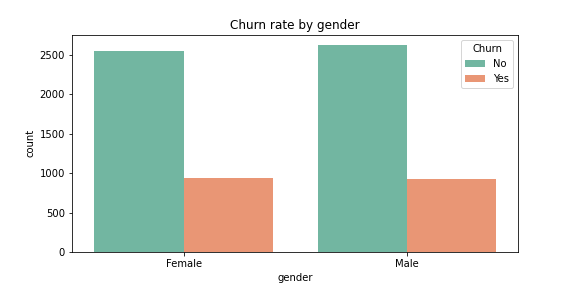

 

Gender and partner distribution in the dataset is relatively balanced, with approximately equal values for each category. Although there is a slightly elevated churn rate in females, the marginal difference is considered negligible. 

 

 

 

 

 

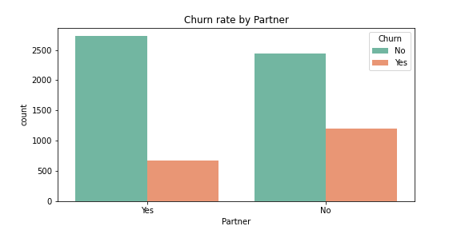

 

 

 

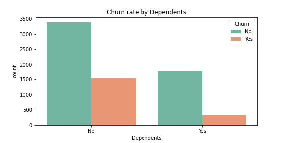

 

Notably, as can be seen from the three plots above a discernible proportion of churn is observed in younger customers (SeniorCitizen = 0), customers without partners, and those without dependents. The demographic analysis underscores non-senior citizens without partners and dependents as a specific customer segment exhibiting a higher likelihood of churning. 

 

 

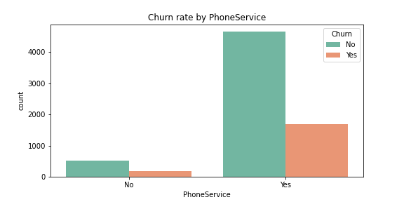

 

 

 

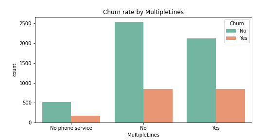

 

If a customer lacks phone service, the possibility of having multiple lines is excluded. Notably, a considerable proportion of customers subscribing to phone services exhibits a heightened likelihood of churning.

 

 

 

 Conversely, customers with fiber optic as their internet service demonstrate an increased propensity to churn, potentially influenced by factors such as elevated costs, market competition, and customer service concerns. The comparatively higher cost of fiber optic service, as opposed to DSL, could be a contributing factor to customer attrition.

 

 

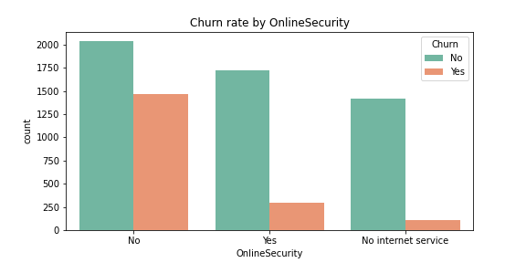

 

 

 

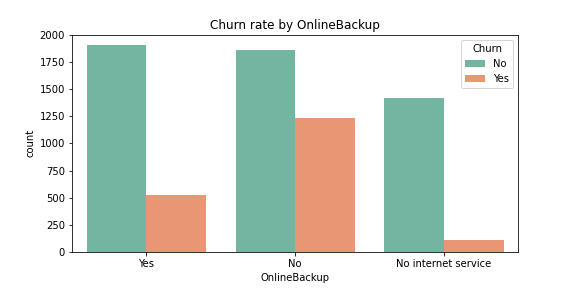

 

 

 

 

 

 

 

Customers availing services like OnlineSecurity, OnlineBackup, DeviceProtection, and TechSupport are notably less inclined to churn.

 

 

 

 

 

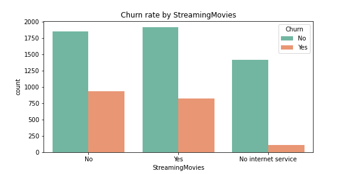

 

Interestingly, the availability of Streaming service appears to exhibit no discernible predictive pattern for churn, as it is evenly distributed among both 'yes' and 'no' options.

 

 

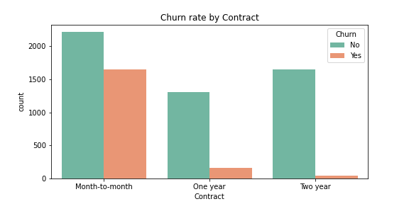

 

The shorter the contract, the higher the churn rate. Those with more extended plans face additional barriers when canceling early. This clearly explains the motivation for companies to have long-term relationships with their customers.

 

 

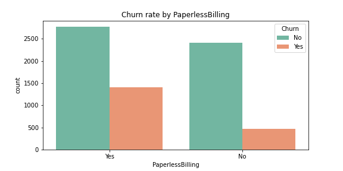

 

 

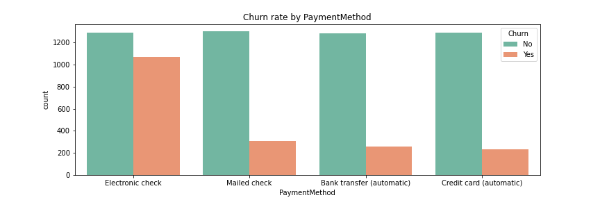

 

 Churn Rate is higher for the customers who opted for paperless billing. Customers who pay with electronic checks are more likely to churn, and this kind of payment is more common than other payment types.

 

In general, the plots above show a consistently low churn rate for each categorical features. Moreso, from the plots, there is a trace of data imbalance which will be investigated using charts.

 

#### **Visualizing the Churn rate per category**

 

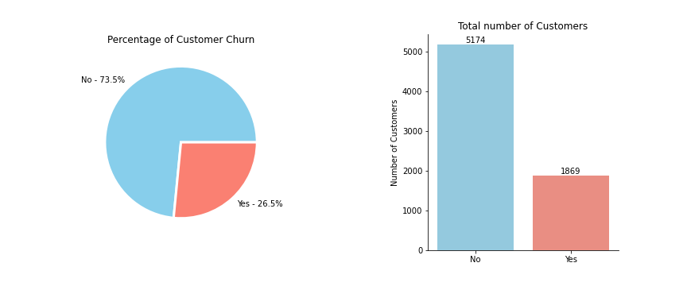

 

The plotted count distribution provides an overview of the `Churn` column in the dataset. The x-axis represents the churn status, distinguishing between customers who have churned and those who have not. The y-axis indicates the count of instances in each category.

This visualization is instrumental for assessing data balance, as an equitable distribution between the two classes is essential for training a robust machine learning model.

The height of the bars show that there is a significant imbalance in the dataset and it is essential to address these imbalances through techniques such resampling.

The dataset exhibits a notable class imbalance, with a substantial majority class and a smaller minority class. Given this imbalance, machine learning algorithms renowned for their ability to handle imbalanced datasets will be employed for model training.

Notably, Random Forest and Support Vector Classifier (SVC) are selected, as these algorithms inherently account for class distribution in their learning processes. Random Forest, in particular, stands out as an ensemble method that has demonstrated effectiveness in addressing class imbalance challenges.

 

# References

[1] Introduction to Churn : https://www.kdnuggets.com/2019/05/churn-prediction-machine-learning.html

[2] Customer Churn and categorical plots: https://neptune.ai/blog/how-to-implement-customer-churn-prediction

[3] Churning : https://www.sciencedirect.com/science/article/pii/S2666603023000143

[4] Churn Rate : https://www.analyticsvidhya.com/blog/2022/09/bank-customer-churn-prediction-using-machine-learning/

[5] Dataset description : https://www.kaggle.com/datasets/blastchar/telco-customer-churn

[6] Dataset overview : https://community.ibm.com/community/user/businessanalytics/blogs/steven-macko/2019/07/11/telco-customer-churn-1113

[7] Encoding Categorical features : https://scikit-learn.org/stable/modules/generated/sklearn.preprocessing.LabelEncoder.html#sklearn.preprocessing.LabelEncoder

[8] Precision as an Evaluation metric : https://scikit-learn.org/stable/modules/generated/sklearn.metrics.precision_score.html#sklearn.metrics.precision_score

[9] Recall Score : https://scikit-learn.org/stable/modules/generated/sklearn.metrics.recall_score.html#sklearn.metrics.recall_score

[10] F1 Score : https://scikit-learn.org/stable/modules/generated/sklearn.metrics.f1_score.html#sklearn.metrics.f1_score